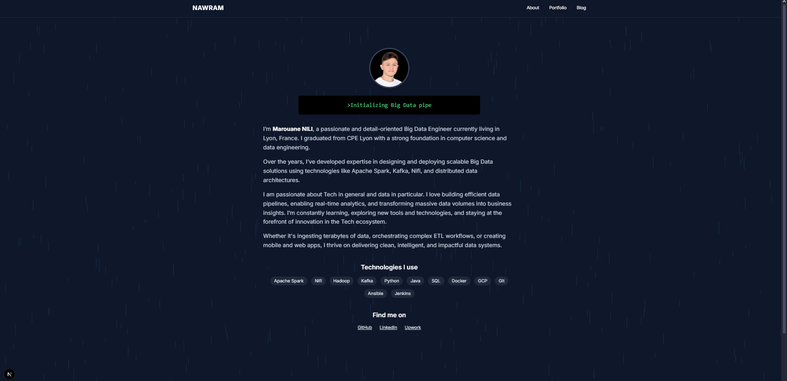

# NAWRAM – Personal Blog and Portfolio

Welcome to my personal blog and  portfolio site, built with **Next.js** and **Tailwind CSS**. This project is designed to showcase my Big Data engineering background, selected projects, blog articles, and professional presence.

## 🚀 Features

* ✨ Interactive landing page with terminal-style intro and animated background
* 👤 About section with profile photo, biography, and technologies
* 🧠 Project portfolio showcasing personal applications
* ✍ Blog system with article previews and individual post pages
* 📱 Responsive design built with Tailwind CSS

## 🛠️ Technologies Used

* **Next.js** – React-based framework for server-side rendering
* **Tailwind CSS** – Utility-first CSS framework for styling

## 📁 Project Structure

```
/src
  /pages
    index.tsx            → Home / About
    /portfolio
      index.tsx          → Project gallery
    /blog
      index.tsx          → Blog listing
      [slug].tsx         → Individual article
  /components
    Header, Footer, About, TerminalIntro, PortfolioGrid, ProjectCard, BlogPreviewCard
  /content
    blog.ts, projects.ts → Content sources
  /styles
    globals.css
```

## 🧑‍💻 Author

**Marouane Nili** – Big Data Engineer @ Sopra Steria

* [LinkedIn](https://www.linkedin.com/in/marouane-nili-1708381b1/)
* [GitHub](https://github.com/marouanenili)
* [Upwork](https://www.upwork.com/freelancers/~01a000000000000001)

## 📷 Preview



## 🧪 Getting Started

1. Clone the repo:

   ```bash
   git clone https://github.com/marouanenili/NAWRAM.git
   cd portfolio
   ```
2. Install dependencies:

   ```bash
   npm install
   ```
3. Run the development server:

   ```bash
   npm run dev
   ```

Then open [http://localhost:3000](http://localhost:3000) in your browser.

---

Built with ❤️ and a love for data.
